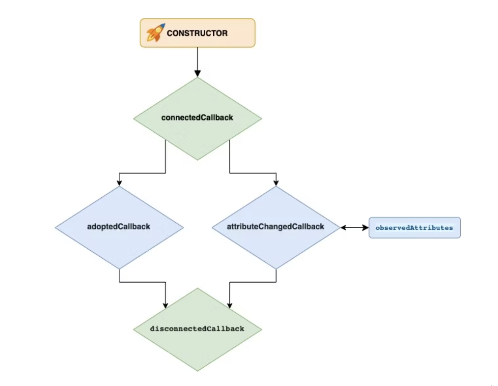
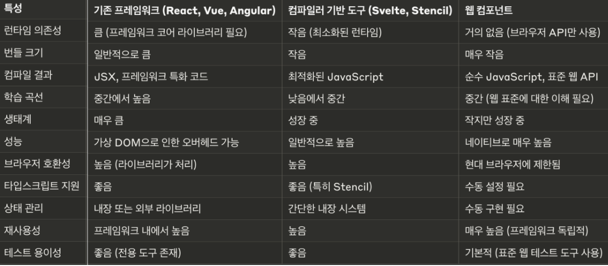

# [4장] 웹 구성 요소

## 📌 개요

- 웹 구성 요소(이하: Web Component로 표기)

  - 오늘날 프론트엔드 프레임워크에서 UI 구성을 위해서는 컴포넌트를 사용함
  - 최신 브라우저에서는 Web Component라는 네이티브 API를 사용해 컴포넌트를 작성할 수 있음
  - Web Component는 재사용할 수 있는 UI 구성 요소를 작성하고 게시할 수 있게 함
  - 또한 어떤 프레임워크와도 호환되는 새로운 컴포넌트를 만들 수 있음 (리액트, 앵귤러, 자바스크립트 페이지, 기타 어떤 도구로 빌드된 레거시 애플리케이션을 포함한 모든 애플리케이션 해당)

## 📌 API (중요 기술)

1. HTML 템플릿
    - `<template>` 태그를 사용하여 콘텐츠를 렌더링 하지 않고 동적으로 콘텐츠 생성 가능
2. 사용자 정의 요소
    - 완전한 기능을 갖춘 커스텀 DOM 요소 작성 가능
3. 섀도우 DOM
    - 컴포넌트 외부의 DOM에 영향을 받지 않아야 하는 경우에 유용 (캡슐화)

### 📌 사용할 수 있을까?

- 웹 구성요소 채택 현황
  - HTML 템플릿, 섀도우 DOM, 사용자 정의 요소에 대해 2020년 12월 기준 크롬, 파이어폭스, 사파리, 에지 모두 지원 (인터넷 익스플로러 미지원)

### 📌 사용자 정의 요소

- Web Component의 핵심 요소
- HTML 요소를 확장하는 자바스크립트 클래스 역할
- 반드시 대시(-)로 구분된 두 단어 이상의 태그를 사용해야 함 (W3c: World Wide Web Consortium에서는 한 단어 태그 사용 가능)
- connectedCallback과 disconnectedCallback 메서드 사용

  ```js
  export default class HelloWorld extends HTMLElement {
    connectedCallback () {
      window.requestAnimationFrame(() => {
        this.innerHTML = '<div>Hello World!</div>'
      })
    }
  }
  ```
  ### 🔨 `connectedCallback`
    - 컴포넌트가 DOM에 연결될 때 호출됨
    - 리액트의 `componentDidMount` 메서드와 유사
    - 컴포넌트의 콘텐츠를 렌더링 하거나 타이머를 시작하거나 네트워크에서 데이터를 가져오기에 좋음
  ### 🔨 `disconnectedCallback`
    - 컴포넌트가 DOM에서 삭제될 때 호출됨
    - 정리 작업에 유용

  ### 사용자 정의 요소 라이프 사이클
  

  ### 어떻게 사용할 수 있을까?

  1. 사용자 정의 요소 생성
  2. 브라우저 컴포넌트 레지스트리에 추가
    - `window.customElements.define` 메서드 사용
    - 태그 이름(ex. 'hello-world')을 사용자 정의 요소 클래스에 연결하는 것을 의미
    - 이 단계를 거쳐야 사용자 정의 태그(<hello-world/>)를 생성한 컴포넌트로 사용할 수 있음

      ```js
      import HelloWorld from './components/HelloWorld.js'

      window
        .customElements
        .define('hello-world', HelloWorld)
      ```
  3. 속성 관리
    - 개요에서 언급한 '모든 프레임워크와 호환'되도록 하기 위해서는 다른 표준 HTML 요소와 동일한 공용 API가 있어야 함
    - 표준 요소의 속성 설정 방법
      1. HTML 마크업에 직접 추가

          ```html
          <!-- getter나 getAttribute 메서드로 동일한 값 읽기 가능 -->
          <input type="text" value="Frameworkless">
          ```
      2. 자바스크립트에서는 setter를 사용해 조작

          ```js
          // 마크업이 새 속성과 동기화 됨
          input.value = 'Frameworkless
          ```
      3. setAttribute 메서드 사용

          ```js
          // 마크업이 새 속성과 동기화 됨
          input.setAttribute('value','Frameworkless')
          ```
    - 사용자 정의 요소의 속성 설정 방법 

      ```js
      const DEFAULT_COLOR = 'black'

      export default class HelloWorld extends HTMLElement {
        get color () {
          return this.getAttribute('color') || DEFAULT_COLOR
        }
        set color (value) {
          this.setAttribute('color', value)
        }

        connectedCallback () {
          window.requestAnimationFrame(() => {
            const div = document.createElement('div')
            div.textcontent = 'Hello World!'
            div.style.color = this.color
            
            this.appendChild(div)
          })
        }
      }
      ```
      - 컴포넌트의 색상을 설정하기 위해서는 setter 혹은 setAttribute를 사용하거나 마크업을 통해 색상을 설정하면 됨
      - color getter와 color setter는 getAttribute/setAttribute에 대한 래퍼 역할일 뿐 (속성을 설정하는 위 세가지 방법이 자동으로 동기화 됨)
  4. 속성 사용

        ```html
        <hello-world></hello-world>
        <hello-world color="red"></hello-world>
        <hello-world color="green"></hello-world>
        ```
    - 위 코드는 `connectedCallback` 메서드의 color 속성 값을 가지며, 이 값을 DOM에 적용함
    - 위와 같은 단계(W3C에서 표준 컴포넌트를 정의하는 방법과 동일)를 통해 속성을 디자인하면 다른 개발자가 컴포넌트를 쉽게 릴리스 하는데 도움이 됨
    - CDN에 컴포넌트 코드만 공개하면 특별한 지침 없이 모두 사용 가능

    - 주의할 점 ❗️
      - HTML 속성은 문자열이기 때문에 문자열이 아닌 속성이 필요한 경우 먼저 속성을 변환해야 함
      - 이 제약 조건은 다른 개발자에게 컴포넌트를 게시해야 하는 경우에만 유효함
      - 실제 Web Component를 기반으로 하는 실제 애플리케이션에서 대부분의 컴포넌트는 게시될 필요가 없음 (생성자의 애플리케이션에서만 비공개로 게시 가능)
      - 이 경우 값을 문자열로 변환하지 않고 setter만 사용

  #### 🔨 `attributeChangedCallback`
    - 속성이 변경될 때 마다 호출됨

      ```js
      const changeColorTo = (color) => {
        document
            .querySelectorAll('hello-world')
            .forEach((helloWorld) => {
              helloWorld.color = color
            })
        
        document
            .querySelector('button')
            .addEventListener('click', () => {
              changeColorTo('blue')
            })
      }
      ```
    - 위 코드에서 버튼 클릭 시 핸들러는 모든 HelloWorld 컴포넌트의 color 속성을 파란색으로 변경 (하지만 화면에는 반영되지 않음)
    - 해결책 1 : setter 자체에 일종의 DOM 조작을 추가 (올바르지 않은 방법) ❌ 

      ```js
      set color (value) {
        this.setAttribute('color', value)
        // 새로운 색상으로 DOM을 업데이트
      }
      ```
      - 빠르지만 더러움
      - color setter 대신 setAttribute 메서드를 사용하면 DOM도 업데이트 되지 않았기 때문에 매우 취약함
    - 해결책 2 : `attributeChangedCallback` 사용 (올바른 방법) ⭕

      ```js
      const DEFAULT_COLOR = 'black'

      export default class HelloWorld extends HTMLElement {
        static get observedAttributes () {
          return ['color']
        }

        get color () {
          return this.getAttribute('color') || DEFAULT_COLOR
        }
        set color (value) {
          this. setAttribute(' color' value)
        }

        attributeChangedCallback (name, oldValue, newValue) {
          if (!this.div) {
            return
          }
          if (name === 'color') {
            this.div.style.color = newValue
          }
        }

        connectedCallback () {
          window.requestAnimationFrame(() => {
            this.div = document.createElement('div')
            this.div.textcontent = 'Hello World!'
            this.div.style.color = this.color
            this.appendChild(this.div)
          })
        }
      }
      ```
      |-|JS객체|DOM|HTML|
      |------|---|---|---|
      | setter | 변경 | 변경안됨 | 변경안됨 |
      | setAttribure | 변경안됨 | 변경안됨 | 변경됨 |
    - 이 방법은 컴포넌트의 라이프사이클 동안 속성이 변경되도록 함
    - `attributeChangedCallback` 메서드는 변경된 속성의 이름, 속성의 이전 값, 속성의 새로운 값 세 가지 매개변수를 받음
    - 모든 속성이 `attributeChangedCallback`을 트리거 하지는 않으며 `observedAttributes` 배열에 나열된 속성만 트리거 한다

- 가상 DOM 통합
    ```js
      attributeChangedCallback (name, oldValue, newValue) {
        if (!this.hasChildNodes()) {
          return
        }
        applyDiff(
          this,
          this•firstElement,
          createDomElement(newValue)
        )
      }
      connectedCallback () {
        window.requestAnimationFrame(() => {
          this.appendChild(createDomElement(this.color))
        })
      }
    ```
  - 가상 DOM 알고리즘은 모든 사용자 정의 요소에 완벽하게 플러그인 될 수 있음
  - 이 시나리오에서는 조금 과도하지만 많은 속성을 가진 컴포넌트의 경우 매우 유용함 (가독성 향상)

- 사용자 정의 이벤트

  - GithubAvatar 예제
    ```html
      <github-avatar user="francesco-strazzullo"></github-avatar>
    ```
  - 동작 방식

    1. 컴포넌트 DOM 연결
    2. 'loading' placeholder 표시
    3. 깃허브 REST API 사용하여 아바타 이미지 URL fetch
    4. 요청 성공 시 아바타 표시
    5. 요청 실패 시 오류 placeholder 표시
  
  - GitHubAvatar 컴포넌트

    ```js
    const ERROR_IMAGE = 'https://files-82ee7vgzc.now.sh'
    const LOADING_IMAGE = 'https://files-8bga2nnt0.now.sh'

    const getGitHubAvatarUrl = async (user) => {
      if (!user) {
        return
      }

      const url = 'https://api.github.com/users/${user}'
    
      const response = await fetch(url)
      if (!response.ok) {
        throw new Error(response.statusText)
      }

      const data = await response.json()
      return data.avatar_url
    }

      export default class GitHubAvatar extends HTMLElement {
        constructor () {
          super()
          this.url = LOADING_IMAGE
        }

        get user () {
          return this.getAttribute('user')
        }
        set user (value) {
          this.setAttribute('user', value)
        }

        render () {
          window.requestAnimationFrame(() => {
            this.innerHTML = ''
            const img = document.createElement('img')
            img.src = this.url
            this.appendChild(img)
          })
        }

        async loadNewAvatar () {
          const { user } = this

          if (!user) {
            return
          }
          try {
            this.url = await getGitHubAvatarUrl(user)
          } catch (e) {
            this.url = ERROR_IMAGE
          }

          this.render()
        }

        connectedCallback () {
          this.render()
          this.loadNewAvatar()
        }
    }
    ```
    
    - attributeChangedCallback 메서드로 user 속성 변경 코드 제외 (단순화 목적)
    - 다양한 컴포넌트의 인스턴스 결과
      

  - 컴포넌트 외부의 HTTP 요청 결과에 반응하는 방법
    - 사용자 정의 요소는 가능한 한 표준 DOM 요소와 동일하게 동작해야 함
    - 컴포넌트에서 정보를 얻는 동일한 방법을 따라 DOM 이벤트를 사용해야 함
  
  - 사용자 정의 이벤트를 가진 GitHubAvatar

    ```js
    const AVATAR_LOAD_COMPLETE = 'AVATAR_LOAD_COMPLETE'
    const AVATAR_LOAD_ERROR = 'AVATAR_LOAD_ERROR’

    export const EVENTS = {
      AVATAR_LOAD_COMPLETE,
      AVATAR_LOAD_ERROR
    }

    export default class GitHubAvatar extends HTMLElement {
      // ...
      onLoadAvatarComplete () {
        const event = new CustomEvent(AVATAR_LOAD_COMPLETE, {
          detail: {
            avatar: this.url
          }
        })

        this.dispatchEvent(event)
      }

      onLoadAvatarError (error) {
        const event = new CustomEvent(AVATAR_LOAD_ERROR, {
          detail: {
            error
          }
        })

        this.dispatchEvent(event)
      }

      async loadNewAvatar () {
        const { user } = this
        if (!user) {
          return
        }
        try {
          this.url = await getGitHubAvatarUrl(user)
          this•onLoadAvatarComplete()
        } catch (e) {
          this.url = ERROR_IMAGE
          this.onLoadAvatarError(e)
        }

        this.render()
      }

      // ...
    }
    ```
    - 새로운 위 GitHubAvatar 컴포넌트는 아바타가 로드 됐을 때, 오류가 발생했을 때의 두 가지 이벤트를 발생시킴

    ```js
    import { EVENTS } from './components/GitHubAvatar.js'

    document
      .querySelectorAll('github-avatar')
      •forEach(avatar => {
        avatar
          . addEventListener(
            EVENTS•AVATAR_LOAD_COMPLETE,
            e => {
              console.log(
              'Avatar Loaded',
              e.detail.avatar
              )
            })

    avatar
      .addEventListener(
        EVENTS•AVATAR_LOAD_ERROR,
        e => {
          console.log(
          'Avatar Loading error',
          e.detail.error
        )
      })
    })
    ```
    - 두 종류의 이벤트에 이벤트 핸들러 연결
    - 올바른 핸들러가 호출됨

## 📌 웹 구성 요소와 렌더링 함수

### 코드 스타일
- 웹 구성 요소
  - `HTMLElement` 클래스를 확장해서 사용하므로 객체지향 프로그래밍을 요구함
- 렌더링 함수
  - 함수형 프로그래밍을 요구함
- 간단한 렌더링 함수로 시작한 뒤에 라이브러리 릴리스가 필요하다면 웹 구성요소로 래핑하면 됨

### 테스트 가능성
- 렌더링 함수를 쉽게 테스트하려면 [Jest](https://jestjs.io/)와 같은 [JSDOM](https://github.com/jsdom/jsdom)과 통합한 테스트 러너를 활용하면 됨

  > 책에서 Jest는 웹 컴포넌트 테스트를 지원하지 않는다고 했는데, 2020년 10월부터 Jest에서 지원한다는 내용을 발견해서 공유드립니다!
  [관련 stackoverflow 답변](https://stackoverflow.com/a/64606792)

### 휴대성 혹은 이식성(portability)
- 기존 DOM 요소와 호환성이 보장되어야 다른 종류의 앱에서 동일하게 동작할 수 있음

### 커뮤니티
- 웹 구성요소 클래스는 대부분의 프레임워크에서 DOM으로 UI 요소를 작성하는 표준방법임
- 규모가 크거나 빠르게 성장하는 팀에서 유용한 기능을 활용할 수 있음

  |   -     | 웹 구성 요소 | 렌더링 함수 |
  | ------- | ------- | ------ |
  | 코드 스타일  | 클래스 기반  | 함수 기반  |
  | 테스트 가능성 | 낮음      | 높음     |
  | 휴대성     | 높음      | 낮음     |
  | 커뮤니티    | 큼       | 작음     |

- 휴대성 : 쉽게 사용가능한가 , 의존도가 낮은가, 재사용에 용이한가
- 이식성(portability) : 소프트웨어나 컴포넌트가 다양한 환경에서 얼마나 쉽게 사용될 수 있는지의 정도

## 📌 사라지는 프레임워크

- "사라지는 프레임워크 또는 "보이지 않는 프레임워크"는 Web Components를 기반으로 한 새로운 접근 방식임
- 이 접근 방식의 핵심 아이디어는 개발 시에는 프레임워크의 편의성을 활용하고, 빌드 시에는 순수한 Web Components로 컴파일되는 것
- 예로 Svelte와 Stencil.js가 있음 
- 추가적인 프레임워크 코드가 필요 없어져 성능이 향상되고, 다른 프레임워크나 바닐라 JavaScript 프로젝트와의 호환성도 좋아짐


## 📌 정리

- Web Components는 재사용 가능하고 캡슐화된 UI 컴포넌트를 만들기 위한 API 세트
- Custom Elements, Shadow DOM, HTML Templates의 조합으로 사용
- 프레임워크에 의존하지 않고도 모듈화되고 유지보수가 쉬운 웹 애플리케이션 구축 가능