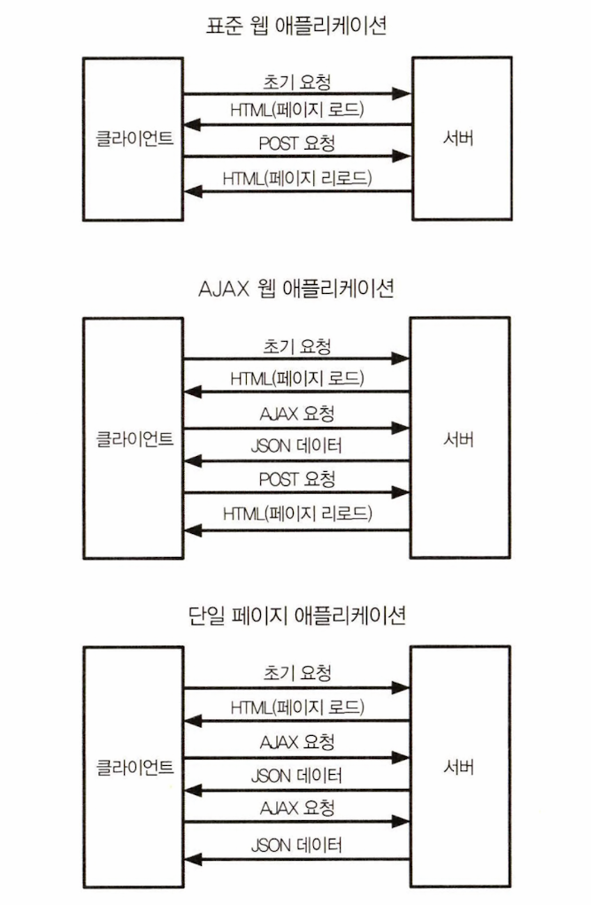
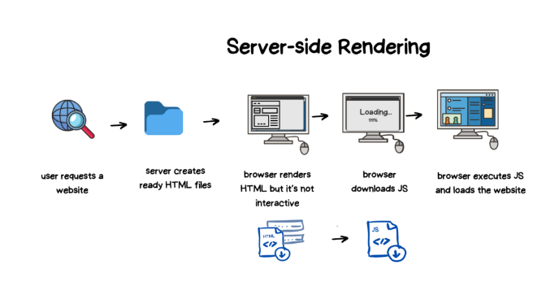
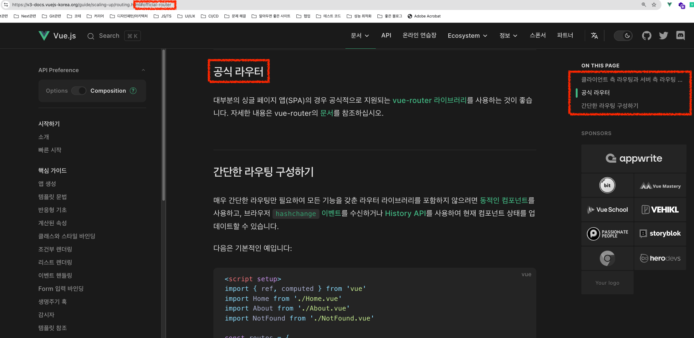
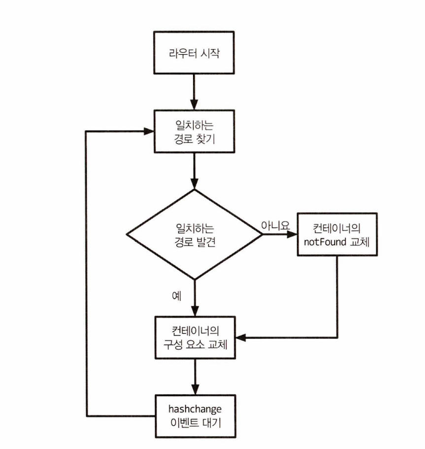

# [6장] 라우팅

# 개요

- 단일 페이지 애플리케이션

  - 하나의 HTML페이지로 사용자가 다른 뷰로 이동할 때 동적으로 다시 그려 표준 웹 탐색 효과를 제공한다.
  - 다중 페이지 애플리케이션에서 페이지 간 탐색시 지연되는 부분을 효율적으로 제거해 더 나은 사용자 경험을 제공한다.

## 1. 서버와의 상호작용에 따른 웹 애플리케이션 아키텍처

단일 페이지 애플리케이션은 서버와의 상호작용을 위해 AJAX를 사용한다. 하지만 모든 AJAX 애플리케이션이 SPA일 필요는 없다.



> 웹 애플리케이션 아키텍처 비교



> 추가로 보면 좋은 SSR ([Next.js의 SSR,SSG,ISR](https://enjoydev.life/blog/nextjs/1-ssr-ssg-isr)까지 봐두면 더 좋다.)

- 이런 아키텍쳐 기반의 애플리케이션은 현대 자바스크립트 프레임워크를 구축하는데 주류 방식이 되었다. 각각의 프레임워크는 라우팅 시스템을 추상화하여 개발자에게 제공한다.
- 모든 라우팅 시스템은 최소 두 가지 핵심 요소를 지니고 있다.
  - 레지스트리 : 모든 애플리케이션의 경로 목록을 지니고 있다.
  - 리스너 : URL이 변경되면 라우터는 특정 컨테이너(뷰)에 현재 URL과 일치하는 경로에 요소를 바인딩 시킨다.

## 2. 라우팅 구현하기

### 프래그먼트 식별자

- 모든 URL은 프래그먼트 식별자라고 불리는 해시(#)로 시작하는 선택적 부분을 포함할 수 있다.
- "https://v3-docs.vuejs-korea.org/guide/scaling-up/routing.html#official-router"라는 URL이 있다면 routing.html뒤에 #이 붙고 그 뒤에 official-router가 식별자다. 즉 id="official-router"로 요소를 식별한다.
- 브라우저는 프래그먼트로 식별된 뷰포트의 맨위에 오도록 페이지를 스크롤한다.



> 실제 페이지 이동 화면

### 동작 예제

```html
<html>
  <body>
    <header>
      <a href="#/">Go To Index</a>
      <a href="#/list">Go To List</a>
      <a href="#/dummy">Dummy Page</a>
    </header>
    <main></main>
    <script type="module" src="index.js"></script>
  </body>
</html>
```

- 앵커 태그를 사용하면 URL이 "http://localhost:8080#/"에서 "http://localhost:8080#/list" 등으로 변경된다.

```javascript
export default (container) => {
  const home = () => {
    container.textContent = "This is Home page";
  };

  const list = () => {
    container.textContent = "This is List Page";
  };

  const notFound = () => {
    container.textContent = "Page Not Found!";
  };

  return {
    home,
    list,
    notFound,
  };
};
```

- container는 특정 URL로 이동시 콘텐츠를 동적으로 업데이트한다.

```javascript
import createRouter from "./router.js";
import createPages from "./pages.js";

const container = document.querySelector("main");

const pages = createPages(container);

const router = createRouter();

router
  .addRoute("#/", pages.home)
  .addRoute("#/list", pages.list)
  .setNotFound(pages.notFound)
  .start();
```

- 그리고 이 구성요소를 올바른 프래그먼트에 연결해야한다.

```javascript
export default () => {
  const routes = [];
  let notFound = () => {};

  const router = {};

  const checkRoutes = () => {
    const currentRoute = routes.find((route) => {
      return route.fragment === window.location.hash;
    });

    if (!currentRoute) {
      notFound();
      return;
    }

    currentRoute.component();
  };

  router.addRoute = (fragment, component) => {
    routes.push({
      fragment,
      component,
    });

    return router;
  };

  router.setNotFound = (cb) => {
    notFound = cb;
    return router;
  };

  router.start = () => {
    window.addEventListener("hashchange", checkRoutes);

    if (!window.location.hash) {
      window.location.hash = "#/";
    }

    checkRoutes();
  };

  return router;
};
```

- 라우터는 세가지의 공개 메서드를 가지고 있다.
  - addRoute : 새 라우터와 프래그먼트로 구성된 객체 요소를 정의한다.
  - setNotFound : 레지스트리에 없는 모든 프래그먼트에 대한 제네릭 구성 요소를 설정한다.
  - start : 라우터를 초기화하고 URL 변경을 확인한다.

**한번 나눠서 분석해보자👀**

```javascript
// router.js
export default () => {
  // 내부 상태 관리
  const routes = [];  // 라우트 정보들을 저장하는 배열
  let notFound = () => {};  // 404 처리를 위한 콜백함수
  const router = {};  // 라우터 객체
  ...
  return router;
};
```

- 기본 틀을 위해 전반적인 인스턴스를 생성하고 캡슐화하고 있다.

```javascript
// router.js
// 핵심 함수
const checkRoutes = () => {
  const currentRoute = routes.find((route) => {
    return route.fragment === window.location.hash;
  });

  if (!currentRoute) {
    notFound();
    return;
  }

  currentRoute.component();
};
```

- 현재 URL의 해시값과 일치하는 라우트를 찾는다.
- 일치하는 라우트가 없으면 notFound함수를 실행한다.
- 일치하는 라우트가 있으면 해당 컴포넌트를 렌더링한다.

```javascript
// router.js
router.addRoute = (fragment, component) => {
  routes.push({
    fragment,
    component,
  });
  return router;
};
```

- 새로운 라우트를 생성하여 등록하는 과정이다.

```javascript
// router.js
router.start = () => {
  window.addEventListener("hashchange", checkRoutes);
  if (!window.location.hash) {
    window.location.hash = "#/";
  }
  checkRoutes();
};
```

- 라우터를 초기화하는 과정이다.
- `hashchange`이벤트를 통해 URL을 감지한다. ([hashchange event](https://developer.mozilla.org/en-US/docs/Web/API/Window/hashchange_event))
- 초기 hash가 없는 경우 기본값("#/")으로 설정한다.



> 지금까지의 흐름도

그러나 동적 프로그래밍 방식으로 뷰의 변경이 필요할 수 도 있다.

```html
<header>
  <button data-navigate="/">Go To Index</button>
  <button data-navigate="/list">Go To List</button>
  <button data-navigate="/dummy">Dummy Page</button>
</header>
```

- 그래서 다음과 같이 `data-set`속성을 부여한다.

```javascript
const NAV_BTN_SELECTOR = "button[data-navigate]";

document.body.addEventListener("click", (e) => {
  const { target } = e;
  if (target.matches(NAV_BTN_SELECTOR)) {
    const { navigate } = target.dataset;
    router.navigate(navigate);
  }
});
```

```javascript
//router.js
router.navigate = (fragment) => {
  window.location.hash = fragment;
};
```

- 다음과 같이 속성을 탐색하여 라우터의 내부를 변경할 때 표준 인터페이스를 유지하도록 래핑했다.

## 3. 경로 매개변수

- 경로 매개변수는 도메인 변수와 관련된 URL의 일부다.
- "http://localhost8080#/order/1" 에서 'order'도메인 모델의 ID를 얻을 수 있다. (즉 id는 1이라는 의미)

> 경로 세그먼트 vs 쿼리 파라미터 방식
>
> 경로 세그먼트 방식은 특정 경로 일부의 리소스를 식별하는 방식이다. 클라이언트에서는 보통 `:id`로 식별자를 확인해 동적 세그먼트 라우팅을 한다.
>
> 쿼리 파라미터 방식은 URL에 `?`다은 `key=value` 형태로 전달하는 방식이다. URL 파라미터라고 불리기도 한다.
> 언제 무엇을 써야 할까??
> 특정 자원을 식별하기 위해서(단수) -> 경로 세그먼트(예시 : 특정 id를 가진 user)
> 필터링, 정렬, 옵션 전달을 위해서(복수) -> 쿼리 파라미터(예시 : 알파벳 순으로 나이가 20살인 user)

```javascript
//page.js
const detail = (params) => {
  const { id } = params;
  container.textContent = `This is Detail Page with Id ${id}`;
};

const anotherDetail = (params) => {
  const { id, anotherId } = params;
  container.textContent = `
        This is Detail Page with Id ${id} 
        and AnotherId ${anotherId}
      `;
};

//index.js
router
  .addRoute("#/", pages.home)
  .addRoute("#/list", pages.list)
  .addRoute("#/list/:id", pages.detail)
  .addRoute("#/list/:id/:anotherId", pages.anotherDetail)
  .setNotFound(pages.notFound)
  .start();
```

- 경로를 다음과 같이 하고, 정규 표현식을 통해 경로 매개변수를 추출해야한다.

> 정규 표현식을 익히기 보다는, 어떤 방향으로 구현되는지가 핵심. (정규표현식에 그리 목매지 말자.)

```javascript
// router.js
const ROUTE_PARAMETER_REGEXP = /:(\w+)/g;
const URL_FRAGMENT_REGEXP = "([^\\/]+)";

const extractUrlParams = (route, windowHash) => {
  const params = {};

  if (route.params.length === 0) {
    return params;
  }

  const matches = windowHash.match(route.testRegExp);

  matches.shift();

  matches.forEach((paramValue, index) => {
    const paramName = route.params[index];
    params[paramName] = paramValue;
  });

  return params;
};

export default () => {
  const routes = [];
  let notFound = () => {};

  const router = {};

  const checkRoutes = () => {
    const { hash } = window.location;

    const currentRoute = routes.find((route) => {
      const { testRegExp } = route;
      return testRegExp.test(hash);
    });

    if (!currentRoute) {
      notFound();
      return;
    }

    const urlParams = extractUrlParams(currentRoute, window.location.hash);

    currentRoute.component(urlParams);
  };

  router.addRoute = (fragment, component) => {
    const params = [];

    const parsedFragment = fragment
      .replace(ROUTE_PARAMETER_REGEXP, (match, paramName) => {
        params.push(paramName);
        return URL_FRAGMENT_REGEXP;
      })
      .replace(/\//g, "\\/");

    routes.push({
      testRegExp: new RegExp(`^${parsedFragment}$`),
      component,
      params,
    });

    return router;
  };

  //...생략
};
```

**addRoutes**

- 정규 표현식을 통해 `:id` 및 `:anotherId`와 매칭된다.
- replace를 통해 특정 파라미터와 매칭 될때 콜백을 호출하여 파라미터 배열을 만든다.

**extractUrlParams**

- Url해쉬에서 매개변수를 추출한다.
- 전체 매칭 결과에서 첫번째 값을 제거한다.
- 남은 매칭된 매개변수를 객체에 할당한다.

> 이렇게만 봐서는 이해가 어려울 수 있다. 예시를 들어보자.

### 매개변수 예제

```javascript
router.addRoute("/posts/:category/:postId", Component);
```

- 특정 파라미터 경로를 담은 URL과 컴포넌트를 등록한다.

````javascript
//addRoute 주요 동작
//ROUTE_PARAMETER_REGEXP로 인해 params = ['category', 'postId']
//ROUTE_PARAMETER_REGEXP = 'posts/([^\\/]+)/([^\\/]+)'

routes.push({
  testRegExp: /^posts\/([^\\/]+)\/([^\\/]+)$/,
  component: Component,
  params: ["category", "postId"],
});```
````

- addRoute에는 정규표현식을 통해 파라미터 및 testRegExp를 추출한다.

```javascript
// extractUrlParams 주요 동작
// 예시로 '#/posts/technology/456로 접속

const matches = "#/posts/technology/456".match(/^posts\/([^\\/]+)\/([^\\/]+)$/);

matches.shift();
// 정규 표현식에 match된 요소
// matches = ["posts/technology/456", "technology", "456"]
// 여기서 'posts/technology/456'는 필요없으니 지워줌.

const params = {
  category: "technology",
  postId: "456",
};

// 마지막으로 파라미터 객체를 만들어준다.
```

> [전체코드](https://github.com/Apress/frameworkless-front-end-development/blob/master/Chapter06/00.2/router.js)는 이곳에서...

## 4. 히스토리 API

- 또한 히스토리 API를 통해 라우팅을 구현할 수 있다.
- 히스토리 API를 사용하면 앞서 보았던 프래그먼트 식별자를 통해 경로를 지정할 필요가 없다.

```javascript
router
  .addRoute("/", pages.home)
  .addRoute("/list", pages.list)
  .addRoute("/list/:id", pages.detail)
  .addRoute("/list/:id/:anotherId", pages.anotherDetail)
  .setNotFound(pages.notFound)
  .start();
```

- 공개 API에 해쉬는 모두 제거해준다.

```javascript
const ROUTE_PARAMETER_REGEXP = /:(\w+)/g;
const URL_FRAGMENT_REGEXP = "([^\\/]+)";
const TICKTIME = 250;

const extractUrlParams = (route, pathname) => {
  const params = {};

  if (route.params.length === 0) {
    return params;
  }

  const matches = pathname.match(route.testRegExp);

  matches.shift();

  matches.forEach((paramValue, index) => {
    const paramName = route.params[index];
    params[paramName] = paramValue;
  });

  return params;
};

export default () => {
  const routes = [];
  let notFound = () => {};
  let lastPathname;

  const router = {};

  const checkRoutes = () => {
    const { pathname } = window.location;
    if (lastPathname === pathname) {
      return;
    }

    lastPathname = pathname;

    const currentRoute = routes.find((route) => {
      const { testRegExp } = route;
      return testRegExp.test(pathname);
    });

    if (!currentRoute) {
      notFound();
      return;
    }

    const urlParams = extractUrlParams(currentRoute, pathname);

    currentRoute.callback(urlParams);
  };

  router.addRoute = (path, callback) => {
    const params = [];

    const parsedPath = path
      .replace(ROUTE_PARAMETER_REGEXP, (match, paramName) => {
        params.push(paramName);
        return URL_FRAGMENT_REGEXP;
      })
      .replace(/\//g, "\\/");

    routes.push({
      testRegExp: new RegExp(`^${parsedPath}$`),
      callback,
      params,
    });

    return router;
  };

  router.setNotFound = (cb) => {
    notFound = cb;
    return router;
  };

  router.navigate = (path) => {
    window.history.pushState(null, null, path);
  };

  router.start = () => {
    checkRoutes();
    window.setInterval(checkRoutes, TICKTIME);
  };

  return router;
};
```

- 앞선 예제에 히스토리 API로 바꾼 코드이다.
- window.location.pathname을 통해 탐색한다.
- `window.history.pushState()`를 통해 네비게이션 한다.
- `setInterval`을 주어서 실시간으로 URL을 체크한다.
- SEO에 더 유리하다고 한다. (검색 엔진은 일반적으로 #이하를 무시하며 별도 페이지로 인식하지 못함, 게다가 해시 기반은 OG이미지 생성에도 불리함.)

> 해쉬기반과 비교했을 때 코드에서 큰 차이는 없지만, URL이 변경될 때 알림을 받을 수 있는 DOM이벤트가 없다는 것이다.
> -> interval로 실시간 감시를 해준다.
> 사실 [popState](https://developer.mozilla.org/ko/docs/Web/API/Window/popstate_event) 이벤트로 어느정도 구현가능하다.

### 링크 사용

- 히스토리 API로 완전히 전환하려면 템플릿에 있는 링크를 업데이트해야 한다.
- 즉 `href`태그를 사용해야 하는데, 잘 동작하지 않는다.

```html
<header>
  <a data-navigation href="/">Go To Index</a>
  <a data-navigation href="/list">Go To List</a>
  <a data-navigation href="/list/1">Go To Detail With Id 1</a>
  <a data-navigation href="/list/2">Go To Detail With Id 2</a>
  <a data-navigation href="/list/1/2">Go To Another Detail</a>
  <a data-navigation href="/dummy">Dummy Page</a>
</header>
```

```javascript
const NAV_A_SELECTOR = "a[data-navigation]";

document.body.addEventListener("click", (e) => {
  const { target } = e;
  if (target.matches(NAV_A_SELECTOR)) {
    e.preventDefault();
    router.navigate(target.href);
  }
});
```

- 다음과 같이 표준 탐색을 비활성화하고 라우터의 navigate메서드를 활용한다.
- 이벤트 버블링을 통해 내부 탐색에 이벤트를 등록하고, `preventDefault`를 통해 표준 핸들러를 비활성화한다. (a태그의 기본동작인 페이지 이동시 새로고침 때문.)

## 5. Navigo

- Navigo는 바닐라 JS환경에서 쉽게 SPA기반 라우팅을 도와주는 도구이다.
- 앞선 장들에서 살펴보았듯 어떤 기술을 사용하던 공개 인터페이스로 쉽게 래핑할 수 있는 구조이다.

```html
<header>
  <a data-navigo href="/">Go To Index</a>
  <a data-navigo href="/list">Go To List</a>
  <a data-navigo href="/list/1">Go To Detail With Id 1</a>
  <a data-navigo href="/list/2">Go To Detail With Id 2</a>
  <a data-navigo href="/list/1/2">Go To Another Detail</a>
  <a data-navigo href="/dummy">Dummy Page</a>
</header>
```

```javascript
export default () => {
  const navigoRouter = new window.Navigo();
  const router = {};

  router.addRoute = (path, callback) => {
    navigoRouter.on(path, callback);
    return router;
  };

  router.setNotFound = (cb) => {
    navigoRouter.notFound(cb);
    return router;
  };

  router.navigate = (path) => {
    navigoRouter.navigate(path);
  };

  router.start = () => {
    navigoRouter.resolve();
    return router;
  };

  return router;
};
```

### 올바른 라우터를 선택하는 방법

- 세 가지 구현에 크게 유의미한 차이는 없다.
- 유의할 점은 히스토리 API는 IE9이하에서는 지원되지 않는다.
- 프로젝트에 리액트 라우터를 사용하는 경우 이 시스템을 변경하기 어렵다. 즉, 특정 라이브러리에 종속되어 버린다.
- (중요)프레임워크 없는 구현으로 라우팅 시스템을 구현해보고 동작 원리를 이해해 서드파티 라이브러리로 전환을 추천한다.

## 6. 보너스(React Router)

- React는 History API를 기반으로 동작한다. (pushState로 이동.)
- 앞에서 봤던 a태그(새로고침 유발) 대신 Link컴포넌트를 사용한다.
- 그러나 History API는 실시간으로 URL 변경을 감지할 이벤트가 존재하지 않는다.
- 그래서 customEvent를 만들어 React Router는 실시간 URL을 감지한다.
- ReactRouter에는 또 다른 이벤트가 있는데, `popState`(native event)로 앞으로가기 뒤로가기를 감지할 수 있다.

```javascript
const customPushState = new Event("pushState");

const CustomLink = ({ to, children }) => {
  const handleClick = (e) => {
    e.preventDefault();
    window.history.pushState({}, "", to); //기본동작 막기
    window.dispatchEvent(customPushState);
  };

  return (
    <a href={to} onClick={handleClick}>
      {children}
    </a>
  );
};

const Router = () => {
  const [currentPath, setCurrentPath] = useState(window.location.pathname);

  useEffect(() => {
    const handlePushState = () => {
      setCurrentPath(window.location.pathname);
    };

    const handlePopState = () => {
      setCurrentPath(window.location.pathname);
    };

    // 커스텀 pushState 이벤트 및 popstate 이벤트 리스너 등록
    window.addEventListener("pushState", handlePushState);
    window.addEventListener("popstate", handlePopState);

    // 컴포넌트 언마운트 시 이벤트 리스너 제거
    return () => {
      window.removeEventListener("pushState", handlePushState);
      window.removeEventListener("popstate", handlePopState);
    };
  }, []);

  return (
    <div>
      <h1>Current Path: {currentPath}</h1>
      {/* 다른 라우터 관련 컴포넌트 렌더링 */}
    </div>
  );
};
```
