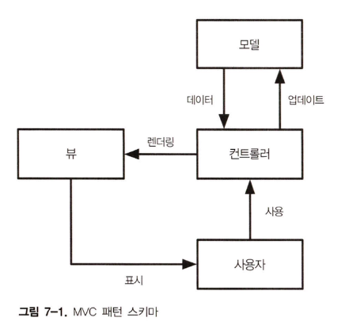
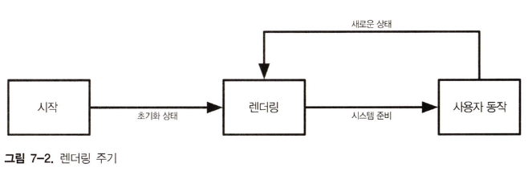
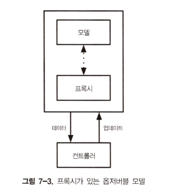
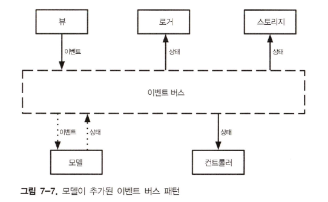

# 7장. 상태 관리

- 상태 관리
  - 프론트엔드 애플리케이션이나 좀더 일반적으로는 모든 종류의 클라이언트 애플리케이션(웹, 데스크톱, 모바일)의 효과적인 데이터 관리 방법입니다.
- 상태 관리는 새로운 문제를 해결하지 못합니다.
  - 즉, 1970년대 등장한 MVC 패턴부터 이미 익숙하게 다뤄온 토픽이었습니다.
- 상태관리 코드에 적합한 아키텍처의 선택은  애플리케이션을 건강하게 유지 관리하는데 중요합니다.

## ToDoMVC 애플리케이션 관리

- 상태 관리 코드는 `events` 객체에 정의되어 있습니다.
- view 함수의 인자로 `events` 객체를 전달하면 DOM 이벤트 핸들러에 연결됩니다.

```js
// Chapter07/00/view/filters.js
export default (targetElement, state, events) => {  
  const newFilters = targetElement.cloneNode(true)  

  const { currentFilter } = state;

  const { changeFilter } = events;
  
  Array  
    .from(newFilters.querySelectorAll('li a'))  
    .forEach(a => {  
      if (a.textContent === currentFilter) {  
        a.classList.add('selected')  
      } else {  
        a.classList.remove('selected')  
      }  
  
      a.addEventListener('click', e => {  
        e.preventDefault()  
        changeFilter(a.textContent)  
      })  
    })  
  
  return newFilters  
}
```

## 모델-뷰-컨트롤러(MVC)

- 디자인 향상을 위해(?) 상태(와 상태를 다루는 수단들)를 컨트롤러가 아닌 별도의 모델로 분리하여 관리합니다.
- 모델을 조회하기 위한 메서드(`getState`)는 불변객체를 반환합니다.
- MVC 패턴은 클라이언트 애플리케이션 관리에 사용된 첫번째 패턴입니다.

### 효과

- 아래 API의 사용자는 상태를 조작하는데 공개 메서드만을 사용할 수 있습니다.
- 비즈니스 로직이 모델 객체에 포함되어 있지 않아야 애플리케이션의 다른 부분에서도 활용할 수 있습니다.
- 상태 관리 코드를 코드베이스 수명기간 동안 높은 수준의 테스트 가능성을 유지하는데 도움을 줍니다.

```js
// Chapter07/00/model/model.js
export default (initalState = INITIAL_STATE) => {  
  const state = cloneDeep(initalState)  
  
  const getState = () => {  
    return Object.freeze(cloneDeep(state))  
  }  
  
  const addItem = text => {  
    // ...
    state.todos.push({  
      text,  
      completed: false  
    })  
  }  
  
  const updateItem = (index, text) => {  
    // ...
    state.todos[index].text = text  
  }  
  
  const deleteItem = index => {  
    // ...
    state.todos.splice(index, 1)  
  }  
  
  const toggleItemCompleted = index => {  
    // ...  
    state.todos[index].completed = !state.todos[index].completed  
  }  
  
  const completeAll = () => {  
    state.todos.forEach(t => {  
      t.completed = true  
    })  
  }  
  
  const clearCompleted = () => {  
    state.todos = state.todos.filter(t => !t.completed)  
  }  
  
  const changeFilter = filter => {  
    state.currentFilter = filter  
  }  
  
  return {  
    addItem,  
    updateItem,  
    deleteItem,  
    toggleItemCompleted,  
    completeAll,  
    clearCompleted,  
    changeFilter,  
    getState  
  }  
}
```

```js
// Chapter07/00/model/index.js
import modelFactory from './model/model.js'  
  
const model = modelFactory()  
  
const events = {  
  addItem: text => {  
    model.addItem(text)  
    render(model.getState())  
  },  
  updateItem: (index, text) => {  
    model.updateItem(index, text)  
    render(model.getState())  
  },  
  deleteItem: (index) => {  
    model.deleteItem(index)  
    render(model.getState())  
  },  
  toggleItemCompleted: (index) => {  
    model.toggleItemCompleted(index)  
    render(model.getState())  
  },  
  completeAll: () => {  
    model.completeAll()  
    render(model.getState())  
  },  
  clearCompleted: () => {  
    model.clearCompleted()  
    render(model.getState())  
  },  
  changeFilter: filter => {  
    model.changeFilter(filter)  
    render(model.getState())  
  }  
}  
  
const render = (state) => {  
  window.requestAnimationFrame(() => {  
    const main = document.querySelector('#root')  
  
    const newMain = registry.renderRoot(  
      main,  
      state,  
      events)  
  
    applyDiff(document.body, main, newMain)  
  })  
}  
  
render(model.getState())
```

### MVC 패턴의 동작원리

1. 컨트롤러는 모델에서 초기 상태를 가져온다.
2. 컨트롤러는 뷰를 호출해 초기 상태를 렌더링한다.
3. 시스템이 사용자 입력을 받을 준비가 된다.
4. 사용자가 어떤 동작을 수행한다.
5. 컨트롤러는 올바른 모델 메서드로 사용자의 동작과 매핑한다.
6. 모델이 상태를 업데이트한다.
7. 컨트롤러는 모델에서 새로운 상태를 얻는다.
8. 컨트롤러는 뷰를 호출해 새로운 상태를 렌더링한다.
9. 다시 3단계로 이동한다.

<div style="width: 100%; display: flex; justify-content: center;">
  
</div>

### 렌더링 주기

- 렌더링과 사용자 동작 사이의 루프입니다.

<div style="width: 100%; display: flex; justify-content: center;">
  
</div>

### 옵저버블 모델

- MVC 패턴의 단점
  - 사용자가 동작을 수행할 때마다 `render` 메서드를 수동으로 호출하기 때문에 모델과 컨트롤러 간의 통합이 완벽하지 않고 오류가 발생하기 쉬운 방법입니다.
  - 동작이 상태를 변경하지 않는 경우에도 `render` 메서드를 호출합니다.
- 모델로부터 상태를 얻는 유일한 방법은 리스너 콜백을 추가하는 것으로, 처음 리스너를 등록했을 때와 내부 상태가 변경될 때마다 콜백이 호출됩니다.

```js
// Chapter07/01/model/model.js
export default (initalState = INITIAL_STATE) => {  
  const state = cloneDeep(initalState)  
  let listeners = []  
  
  const addChangeListener = listener => {  
    listeners.push(listener)  

    // 추가된 시점의 상태를 반영하기 위해 즉시 리스너를 실행
    // listener 내부에서 state를 조작할 수 없도록 freeze 처리
    listener(freeze(state))  

    // 추가했던 리스너를 listeners로부터 제외하기 위한 cleanup 함수를 반환  
    return () => {  
      listeners = listeners.filter(l => l !== listener)  
    }  
  }  
  
  const invokeListeners = () => {  
    const data = freeze(state)  
    listeners.forEach(l => l(data))  
  }

  // 상태가 변경되는 로직의 마지막에 리스너를 실행
  
  const addItem = text => {  
    // ...
    state.todos.push({  
      text,  
      completed: false  
    })  
  
    invokeListeners()  
  }  
  
  const updateItem = (index, text) => {  
    // ...
    state.todos[index].text = text  
  
    invokeListeners()  
  }  
  
  const deleteItem = index => {  
    // ...
    state.todos.splice(index, 1)  
  
    invokeListeners()  
  }  
  
  const toggleItemCompleted = index => {  
    // ...
    state.todos[index].completed = !state.todos[index].completed  
  
    invokeListeners()  
  }  
  
  const completeAll = () => {  
    state.todos.forEach(t => {  
      t.completed = true  
    })  
  
    invokeListeners()  
  }  
  
  const clearCompleted = () => {  
    state.todos = state.todos.filter(t => !t.completed)  
    
    invokeListeners()  
  }  
  
  const changeFilter = filter => {  
    state.currentFilter = filter  
    
    invokeListeners()  
  }  
  
  return {  
    addItem,  
    updateItem,  
    deleteItem,  
    toggleItemCompleted,  
    completeAll,  
    clearCompleted,  
    changeFilter,  
    addChangeListener  
  }  
}
```

- 옵저버블 모델은 모델의 공개 인터페이스를 수정하지 않고 컨트롤러에 새로운 기능을 추가할 때 유용합니다.
  - `render` 메서드와 같이 리스너로 등록만 하면 됩니다.
- 컨트롤러가 모델과 밀접하게 결합된다면 도입을 고려해볼 가치가 있습니다.

```js
// Chapter07/01/model/index.js
import modelFactory from './model/model.js'  

const model = modelFactory()  
  
const {  
  addChangeListener,  
  ...events  
} = model  
  
const render = (state) => {  
  window.requestAnimationFrame(() => {  
    const main = document.querySelector('#root')  
  
    const newMain = registry.renderRoot(  
      main,  
      state,  
      events)  
  
    applyDiff(document.body, main, newMain)  
  })  
}  

// 옵저버블에 render 함수를 리스너로 등록하여 자동으로 리렌더링이 일어남
addChangeListener(render)
```

```js
// Chapter07/01.1/index.js

// ...

addChangeListener(render)

addChangeListener((state) => {
  Promise.reslove().then(() => {
    window.localStorage.setItem('state', JSON.stringify(state))
  })
})
```

## 반응형 프로그래밍

- 반응형 패러다임
  - 애플리케이션이 모델 변경, HTTP 요청, 사용자 동작, 탐색 등과 같은 이벤트를 방출할 수 있는 옵저버블로 동작합니다.
  - 자신의 코드에서 여러 옵저버블을 사용하고 있다면 이미 반응형 패러다임으로 작업하는 겁니다.
- 참고자료
  - [반응형 프로그램 소개](https://gist.github.com/staltz/868e7e9bc2a7b8c1f754)
  - [Front-End Reactive Architecture](https://link.springer.com/book/10.1007/978-1-4842-3180-7)

### 반응형 모델

- 다양한 모델 객체를 갖고 있는 복잡한 애플리케이션에서 옵저버블을 생성하기 쉬운 방법이 필요합니다.
- 도메인 로직에만 집중하고 아키텍처 부분은 별도로 분리하기 위해 옵저버블 팩토리를 모델을 설계할 수 있습니다.

<div style="width: 100%; display: flex; justify-content: center;">
  
</div>

```js
// Chapter07/02/model/model.js
import observableFactory from './observable.js'

export default (initalState = INITIAL_STATE) => {
  const state = cloneDeep(initialState)

  // ...

  const model = {
	addItem,  
	updateItem,  
    deleteItem,  
    toggleItemCompleted,  
    completeAll,  
    clearCompleted,  
    changeFilter,
  }
  
  return observableFactory(model, () => state)
}
```

- 외부에서 보면 proxy 적용 전후로 옵저버블 모델은 동일한 공개 인터페이스를 갖습니다.
- 반응형 상태 관리 아키텍처를 설계하는 좋은 방법은 간단한 옵저버블 모델을 만드는 겁니다.
  - 옵저버블 생성을 추상화한 팩토리를 사용하면 다수의 옵저버블을 쉽게 만들 수 있습니다.

```js
// Chapter07/02/model/observable.js
const cloneDeep = (x) => {  
  return JSON.parse(JSON.stringify(x))  
}  
  
const freeze = (state) => Object.freeze(cloneDeep(state))  

// 최신 state를 참조할 수 있도록 getter로 state를 전달 
export default (model, stateGetter) => {  
  let listeners = []  

  // 이전에 model.js에 있던 addChangeListener, invokeListener가 observer로 이동됨
  
  const addChangeListener = (listener) => {  
    listeners.push(listener)  
    listener(freeze(stateGetter()))  
    return () => {  
      listeners = listeners  
        .filter(element => element !== listener)  
    }  
  }  
  
  const invokeListeners = () => {  
    const data = freeze(stateGetter())  
    listeners.forEach(l => l(data))  
  }  

  // 기존 함수의 기능을 확장하기 위한 고차함수
  const wrapAction = (originalAction) => {  
    return (...args) => {  
      const value = originalAction(...args)  
      invokeListeners()  
      return value  
    }  
  }  
  
  const baseProxy = {  
    addChangeListener  
  }  

  // 원본 모델의 개별 메서드의 이름과 기능은 그대로 유지하면서,
  // state를 수정하면 옵저버블에 등록된 listener들을 호출하는 옵저버블 proxy 객체 생성
  return Object  
    .keys(model)  
    .filter(key => {  
      return typeof model[key] === 'function'  
    })  
    .reduce((proxy, key) => {  
      const action = model[key]  
      return {  
        ...proxy,  
        [key]: wrapAction(action)  
      }  
    }, baseProxy)  
}
```

### 네이티브 프록시

- [Proxy API](https://developer.mozilla.org/en-US/docs/Web/JavaScript/Reference/Global_Objects/Proxy)를 사용하면 객체의 디폴트 동작을 사용자 정의 코드로 쉽게 래핑할 수 있습니다.
- 프록시를 만드려면 객체의 기본 동작을 래핑하는 [트랩(trap) 집합](https://developer.mozilla.org/en-US/docs/Web/JavaScript/Reference/Global_Objects/Proxy#object_internal_methods)으로 구성된 핸들러가 필요합니다.

```js
// Chapter07/02.2/model/observable.js
export default (initialState) => {
  let listeners = []

  const proxy = new Proxy(cloneDeep(initialState), {
    set(target, name, value) {
      target[name] = value;
      listeners.forEach((l) => l(freeze(proxy)))
      return true
    }
  })

  // proxy에 등록된 set trap이 호출되지만,
  // listeners가 빈 배열이므로 아무 일이 일어나지 않음
  proxy.addChangeListener = (listener) => {
    listeners.push(listener)
    listener(freeze(proxy))
    return () => {
      listeners = listeners.filter((l) => l !== listener)
    }
  }

  return proxy
}
```

- 이전 반응형 모델과의 차이점
  - `set` trap이 호출하도록 덮어쓰는(또는 교체하는) 방식으로 state를 업데이트합니다.
  - 모델이 아닌 state를 래핑합니다.

```js
// Chapter07/02.2/model/model.js
export default (initialState) => {
  const state = observableFactory(initialState)  
  
  const addItem = text => {  
    // ...
    state.todos = [...state.todos, {  
      text,  
      completed: false  
    }]  
  }  
  
const updateItem = (index, text) => {  
  // ...
  state.todos = state.todos.map((todo, i) => {  
    if (i === index) {  
      todo.text = text  
    }  
    return todo  
  })  
}  
  
const deleteItem = index => {  
  // ...
  state.todos = state.todos.filter((todo, i) => i !== index)  
}  
  
const toggleItemCompleted = index => {  
  // ...
  state.todos = state.todos.map((todo, i) => {  
    if (i === index) {  
      todo.completed = !todo.completed  
    }  
    return todo  
  })  
}  
  
const completeAll = () => {  
  state.todos = state.todos.map((todo, i) => {  
    todo.completed = true  
    return todo  
  })  
}  
  
const clearCompleted = () => {  
  state.todos = state.todos.filter(t => !t.completed)  
}  
  
const changeFilter = filter => {  
  state.currentFilter = filter  
}  
  
return {  
  addChangeListener: state.addChangeListener,  
  addItem,  
  updateItem,  
  deleteItem,  
  toggleItemCompleted,  
  completeAll,  
  clearCompleted,  
  changeFilter  
}
}
```

## 이벤트 버스

<div style="width: 100%; display: flex; justify-content: center;">
  
</div>

- 이벤트 버스 패턴
  - 이벤트 주도 아키텍처(EDA, Event Driven Architecture)를 구현하는 방법입니다.
  - 모든 상태 변경은 시스템에서 전달된 이벤트로 나타납니다.
  - 이벤트
    - 발생한 상황을 식별하는 이름과 이벤트 처리를 위해 의미있는 정보를 담고 있는 페이로드로 정의됩니다.

```js
const event = {
  type: 'ITEM_ADDED',
  payload: 'Buy Milk'
}
```

- 애플리케이션을 구성하는 노드들을 연결하는 단일 객체가 모든 이벤트를 처리합니다(이벤트 위임)
  - 이벤트가 처리되면 결과가 완료된 모든 노드로 전송됩니다.
- 상태 관리에 이벤트 버스를 사용하는 경우, 이벤트 처리 결과는 업데이트된 애플리케이션 상태입니다.
- 동작방식
  1. 뷰는 초기 상태를 렌더링한다.
  2. 시스템이 사용자 입력을 받는다.
  3. DOM 이벤트가 뷰에 의해서 캡처된다.
  4. 뷰는 이벤트를 생성하고 버스로 전송한다.
  5. ~~버스는~~ 모델은 버스를 통해 전달된 이벤트로 새로운 상태를 생성한다.
      - 모델 = `(이전 상태, 이벤트) => 새로운 상태`
  6. 새로운 상태가 컨트롤러로 전송된다.
  7. 컨트롤러가 뷰를 호출하여 새로운 상태를 렌더링한다.
  8. 2단계로 이동한다.

### 프레임워크 없는 구현

- 이 시나리오에서 모델은 이전 상태와 이벤트를 받아 새로운 상태를 반환하는 순수함수입니다.
- 모델을 순수함수로 설계하면...
  - 새로운 상태가 곧 모델 자체의 (내부) 상태가 되므로 테스트 가능성을 크게 향상시킵니다.
  - 상태가 업데이트되면 항상 새 객체가 된다는 점을 역으로 이용하여 성능을 최적화 시킬 수 있습니다.
    - 이전 상태와 새로운 상태가 동일한 참조를 가진다면 일부 리스너를 실행하지 않아도 됩니다.

```js
// Chapter07/03/model/model.js

// event.type에 대응되는 메서드를 객체로 정의하면 매우 긴 switch문을 작성하지 않아도 됨
const methods = {  
  ITEM_ADDED: addItem,  
  ITEM_UPDATED: updateItem,  
  ITEM_DELETED: deleteItem,  
  ITEMS_COMPLETED_TOGGLED: toggleItemCompleted,  
  ITEMS_MARKED_AS_COMPLETED: completeAll,  
  COMPLETED_ITEM_DELETED: clearCompleted,  
  FILTER_CHANGED: changeFilter  
}

export default (initialState) => {
  return (prevState, event) => {

    // 매개변수 없이 호출하면 애플리케이션의 초기 상태를 얻을 수 있음
    if (!prevState) {
      return cloneDeep(initialState)
    }

    // 이벤트에 대응되는 상태 업데이트 함수
    const currentModifier = methods[event.type]

	if (!currentModifier) {
	  return prevState
	}

    return currentModifier(prevState, event)
  }
}
```

```js
// Chapter07/03/model/eventBus.js
export default (model) => {  
  let listeners = []

  // 초기 상태를 사용
  let state = model()
  
  const subscribe = (listener) => {  
    listeners.push(listener)  
  
    return () => {  
      listeners = listeners.filter((l) => l !== listener)  
    }  
  }  
  
  const invokeSubscribers = () => {  
    const data = freeze(state)  
    listeners.forEach((l) => l(data))  
  }  
  
  const dispatch = event => {  
    const newState = model(state, event)  
  
    if (!newState) {  
      throw new Error('model should always return a value')  
    }  

    // 상태가 업데이트되지 않았다면 리스너를 실행하지 않음
    if (newState === state) {  
      return  
    }  
  
    state = newState  

    invokeSubscribers()  
  }  
  return {  
    subscribe,  
    dispatch,  
    getState: () => freeze(state)  
  }  
}
```

- 실제 어플리케이션에서 모델은 코드의 가독성을 높이기 위해 용도별로 더 작은 서브 모델로 분리되어야 합니다.

```js
// Chapter07/03.1/model/model.js

// 두 서브모델인 todosModel, filterModel
import todosModel from './todos.js'  
import filterModel from './filter.js'

export default (initalState = INITIAL_STATE) => {  
  return (prevState, event) => {  
    if (!event) {  
      return cloneDeep(initalState)  
    }  
  
    const {  
      todos,  
      currentFilter  
    } = prevState  
    
    const newTodos = todosModel(todos, event)  
    const newCurrentFilter = filterModel(currentFilter, event)  
  
    if (newTodos === todos && newCurrentFilter === currentFilter) {  
      return prevState  
    }  
  
    return {  
      todos: newTodos,  
      currentFilter: newCurrentFilter  
    }  
  }  
}
```

- 이벤트 버스를 기반으로 하는 컨트롤러에서 `renderRoot`에 이벤트 핸들러가 아닌 `dispatch` 메서드를 제공합니다.

```js
// Chapter07/03.1/index.js
import applyDiff from './applyDiff.js'  
import eventBusFactory from './model/eventBus.js'  
import modelFactory from './model/model.js'  
  
const modifiers = modelFactory()  
const eventBus = eventBusFactory(modifiers)  
  
const render = (state) => {  
  window.requestAnimationFrame(() => {  
    const main = document.querySelector('#root')  
  
    const newMain = registry.renderRoot(  
      main,  
      state,  
      eventBus.dispatch // <<
    )  
  
    applyDiff(document.body, main, newMain)  
  })  
}  

// dispatch가 일어날 때마다 리렌더링 수행
eventBus.subscribe(render)
  
render(eventBus.getState())
```

```js
// Chapter07/03.1/view/app.js
const addEvents = (targetElement, dispatch) => {  
  targetElement  
    .querySelector('.new-todo')  
    .addEventListener('keypress', e => {  
      if (e.key === 'Enter') {
        dispatch(eventCreators.addItem(e.target.value)) // 👈   
        e.target.value = ''  
      }  
    })  
  
  targetElement  
    .querySelector('input.toggle-all')  
    .addEventListener('click', () => {
      dispatch(eventCreators.completeAll()) // 👈 
    })  
  
  targetElement  
    .querySelector('.clear-completed')  
    .addEventListener('click', () => {  
      dispatch(eventCreators.clearCompleted()) // 👈 
    })  
}  
  
export default (targetElement, state, dispatch) => {  
  const newApp = targetElement.cloneNode(true)  

  // ...
  
  addEvents(newApp, dispatch)  
  
  return newApp  
}
```

### Redux

- 2015년 댄 아브라모브(Dan Abramov)가 소개한 상태관리 라이브러리
  - [공식문서](https://redux.js.org/)
- "프레임워크 없는 이벤트 버스"와 매우 유사한 구조를 가집니다.
  - 이벤트 버스 -> 스토어
  - 이벤트 -> 액션
  - 모델 -> 리듀서
- Redux DevTools와 같은 가용한 도구와 플러그인을 제공하기 때문에 "프레임워크 없는 이벤트 버스" 보다 널리 실무에서 널리 사용됩니다.

```js
// Chapter07/04/index.js
const store = createStore(  
  reducer,  
  INITIAL_STATE,  
  window.__REDUX_DEVTOOLS_EXTENSION__ && window.__REDUX_DEVTOOLS_EXTENSION__()  
)  
  
const render = () => {  
  window.requestAnimationFrame(() => {  
    const main = document.querySelector('#root')  
  
    const newMain = registry.renderRoot(  
      main,  
      store.getState(),  
      store.dispatch
    )  
  
    applyDiff(document.body, main, newMain)  
  })  
}  
  
store.subscribe(render)  
  
render()
```

## 상태 관리 전략 비교

### 모델-뷰-컨트롤러

- 장점
  - **구현하기 매우 간단합니다.**
  - 도메인 비지니스 로직에 대한 테스트 가능성과 관심사의 분리가 용이합니다.
- 단점
  - 엄격한 패턴이 아니라서 뷰, 컨트롤러, 모델 사이의 관게가 불분명합니다(=회색 영역)
    - 프레임워크마다 서로 다른 버전의 MVC가 구현됩니다.
    - 프레임워크 없는 MVC를 도입한다면 팀 내에서 규칙을 정의해야 합니다.
  - "회색 영역"으로 인해 애플리케이션이 커질수록 가독성과 확장성이 떨어집니다.

### 반응형 프로그래밍

- 장점
  - 옵저버블 모델에 기반하여 동일한 타입의 객체로 작업하기 때문에 **뛰어난 일관성을 보장합니다.**
- 단점
  - 모든 옵저버블을 추상화화하는 부분이 단순하지 않을 수도 있습니다.
    - 이를 ["누설된 추상화(Leaky Abstraction)"](https://en.wikipedia.org/wiki/Leaky_abstraction#:~:text=A%20leaky%20abstraction%20in%20software,fails%20to%20completely%20do%20so.)라고 합니다.
      - 간결하게 로직을 구현할 수 있도록 복잡한 시스템을 감춰서 추상화했더니 오히려 복잡해지니까 문제를 해결하려는 사용자들에 의해 내부 구현방식이 들춰지는 문제입니다.
      - 보통 중앙 추상화를 추구하는 패턴이나 프레임워크에서 발생합니다.
  - 애플리케이션이 커질수록 추상화에 적합하지 않은 부분이 생기면서 확장성에 걸림돌이 될 수 있습니다.

### 이벤트 버스

- 장점
  - 모든 상태 변경은 이벤트에 의해서만 가능하기 때문에 애플리케이션의 크기에 비례해서 복잡성이 유지됩니다.
    - 규모가 커질수록 복잡성이 기하급수적으로 늘어나는 다른 아키텍처들에 비해서 확장성이 용이합니다.
  - 반응형 프로그래밍에 비해 상대적으로 추상화 정도가 낮기 때문에 단순합니다.
- 단점
  - [다변성(Verbosity)](https://www.lenovo.com/us/en/glossary/verbose/?srsltid=AfmBOorgDrkmH5J6y6oTzYa9QNDbi-FqSOtkARFpctJ_lvpDI3J-anUR)을 수반합니다.
    - 모든 상태 업데이트 로직에 대해 다수의 단계를 거쳐야 하는 즉, 필요 이상의 번거로움과 복잡성을 가져옵니다.
  - 다변성에 의해서 작거나 간단한 도메인 관리를 위해 다른 상태 관리 전략을 도입할 수도 있어서 결과적으로 일관성이 떨어질 수 있습니다.
